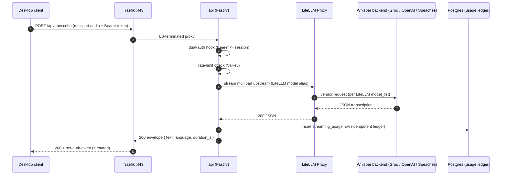
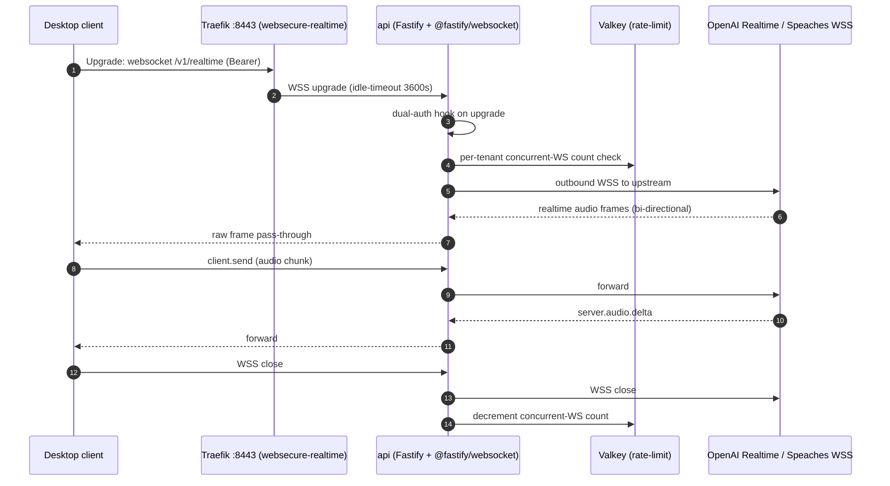
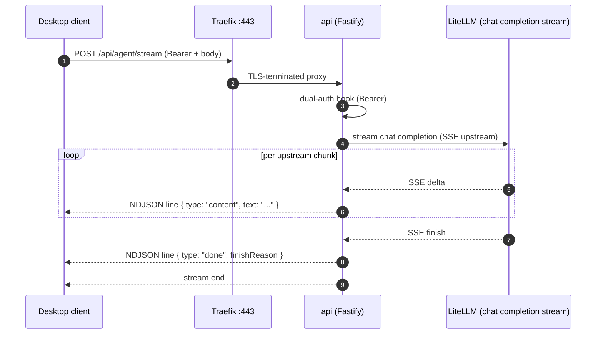
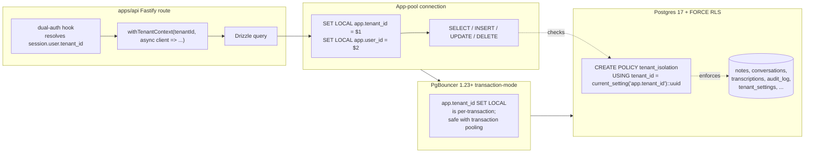

# OpenWhispr Server — System Architecture

> Phase 10 / Plan 10-03 (DOCS-02). Authoritative high-level architecture
> reference for OpenWhispr Server. Cross-link target for the README
> documentation index and the operator handbook.

OpenWhispr Server is a stateless Fastify-5 / Node.js-24 backend for the
OpenWhispr Electron desktop client. It bundles a default LiteLLM Proxy
wired to open-source / public-API AI models out of the box and accepts
a corporate LiteLLM override at deploy time without code changes. The
data plane is PostgreSQL 17 with row-level multi-tenancy; the job plane
is BullMQ on Valkey/Redis; the AI plane is LiteLLM Proxy. The system
target is 1000 concurrent active users in a single installation.

This document is the consolidated map of the components, the hot-path
sequence flows, the tenant-isolation chokepoint, and the BullMQ
topology. It is companion-read with:

- [`operations.md`](./operations.md) — upgrade / scale / restore / i18n runbooks
- [`security.md`](./security.md) — SSRF gate, secret loading, audit-log threat model
- [`wire-contract.md`](./wire-contract.md) — v1 wire surface and v2-deferred routes
- [`auth.md`](./auth.md) — Better Auth, dual auth, channel-scheme echo

---

## 1. Component decomposition

OpenWhispr Server ships as nine distinct runtime units. Each maps to
a service in `docker-compose.yml` and to a Deployment / StatefulSet in
the Helm chart at `charts/openwhispr/`.

| Component   | Image / process                           | Role                                                                  | Compose service | Helm workload          |
| ----------- | ----------------------------------------- | --------------------------------------------------------------------- | --------------- | ---------------------- |
| api         | `apps/api` (Node 24 + Fastify 5)          | HTTP + WSS surface; Better Auth; route handlers; BullMQ producer      | `api`           | Deployment + HPA       |
| worker      | `apps/worker` (Node 24 + BullMQ)          | All 8 job queues; email delivery; spend ingest; partman; rotations    | `worker`        | Deployment + HPA       |
| web         | `apps/web` (Next.js 15 App Router)        | Operator + end-user web UI; Edge-runtime locale negotiation           | `web`           | Deployment             |
| postgres    | CloudNativePG 1.29 (Postgres 17 + pgpartman) | Single source of truth; FORCE RLS; partitioned audit_log + usage     | `postgres`      | CNPG `Cluster` CR      |
| pgbouncer   | bitnami/pgbouncer 1.23+                   | Transaction-mode connection pool; bridges app pools to Postgres       | `pgbouncer`     | Deployment             |
| valkey      | bitnami/valkey 8.x (Redis 7.4-compatible) | BullMQ queue substrate; rate-limit counters; WS fan-out               | `valkey`        | StatefulSet            |
| litellm     | `openwhispr-litellm:r31-patched` (locally built on `ghcr.io/berriai/litellm:main-v1.83.14-stable`) | LLM / Whisper / Realtime gateway; corporate-override target           | `litellm`       | Deployment             |
| minio       | bitnami/minio                             | S3-compatible object store; WAL archive sink; future audio archives   | `minio`         | Deployment / DistMode  |
| traefik     | traefik 3.x                               | TLS termination; HTTPS-only; `:443` HTTP + `:8443` realtime WSS       | `traefik`       | Helm Traefik chart (separate install) |

Every external connection terminates at Traefik. Traefik fronts two
entrypoints — `:443` for the HTTP surface and `:8443` for the realtime
WSS — and forwards plaintext HTTP only on the loopback inside the pod
or compose network. Plaintext HTTP on an externally reachable port is
a constitutional rule (CLAUDE.md) and the chart values schema rejects
configurations that violate it.

The api process is fully stateless. Every horizontal replica reads its
session, rate-limit, and queue state from Valkey; its tenant-scoped
data from PgBouncer-fronted Postgres; and its AI calls from LiteLLM
(bundled or corporate). The HPA scales the api Deployment on a blend
of CPU utilization and p95 latency from the Mimir / Prometheus stack.

The worker process is also stateless. Every replica connects to the
same 8 BullMQ queues; concurrency is BullMQ-managed. The HPA scales
the worker Deployment on Redis queue depth via the
`prometheus-redis-exporter` ServiceMonitor.

The web process is a Next.js 15 App Router server. Locale negotiation
happens at the Edge middleware (Phase 10 Plan 10-02) and is forwarded
to RSC layouts through an `x-locale` header. The web tier never holds
session state — Better Auth cookies and bearer tokens flow through to
the api tier on every request.

---

## 2. Hot-path sequence diagrams

The three hot paths below carry the bulk of production traffic. Each
diagram cites the source file that implements it so the diagram and
the codebase stay in sync.

### 2.1 `POST /api/transcribe` (Whisper STT through LiteLLM)

Implemented in `apps/api/src/routes/transcribe.ts`. Multipart body is
streamed through Fastify's `@fastify/multipart` adapter, forwarded to
LiteLLM via `@fastify/http-proxy`, and the upstream JSON is returned
through the centralized envelope handler.



Rate-limit bypass and HTTP error paths return the global envelope
shape `{ error: "<message>" }` (D-35). When LiteLLM upstream returns
non-2xx, the centralized `setErrorHandler` converts the
`UpstreamError` to **HTTP 502** with the localized envelope (Phase 10
Plan 10-01a).

### 2.2 `WSS /v1/realtime` (OpenAI Realtime reverse proxy on `:8443`)

Implemented in Phase 4. Traefik's `websecure-realtime` entrypoint on
port `:8443` is required because the OpenAI Realtime upstream needs
upgraded raw WebSocket frames and a 3600s idle timeout that the
standard `:443` entrypoint does not provide.



If `OPENAI_API_KEY` is unset, the upgrade closes with an error frame
rather than completing — this is documented in the wire contract
(`/v1/realtime` row in `wire-contract.md`) and behaviour-tested in the
Phase 4 contract suite.

### 2.3 `POST /api/agent/stream` (NDJSON line-flush)

Implemented in Phase 4. The route returns `application/x-ndjson` and
flushes one chunk per line. The chunk vocabulary (`StreamChunk` in
`apps/api/src/lib/sse-parser.ts`) is `content` (text delta), `tool_call`
(consolidated tool call), and `done` (terminal marker). Backpressure is
handled by Fastify's `reply.raw.write` calls plus a single periodic
`flush()`.



Connection idle behaviour: the route writes one heartbeat NDJSON line
every 15s if the upstream is silent; the desktop client treats absent
chunks for >30s as a network failure and reconnects (out of scope for
this doc — see the desktop project's `withSessionRefresh()` helper).

---

## 3. Tenant isolation diagram

OpenWhispr Server runs row-level multi-tenancy through PostgreSQL FORCE
RLS. The chokepoint is a per-statement `SET LOCAL` of the
`app.tenant_id` GUC, invoked by the `withTenantContext()` helper
defined in `apps/api/src/lib/with-tenant-context.ts` (api side) and
`apps/worker/src/lib/with-tenant-context.ts` (worker side). FORCE RLS
on every tenant-owned table means no SQL path bypasses it — not even
the `postgres` superuser bypasses FORCE RLS without an explicit
`BYPASSRLS` role grant, which the application role does NOT hold.



Notes:

- PgBouncer transaction-mode is safe because every tenant-scoped query
  runs inside `withTenantContext()`, which opens an explicit
  transaction (`BEGIN`) before issuing `SET LOCAL` and commits at the
  end of the callback. The GUC dies with the transaction, so the next
  pool checkout starts clean.
- The application role is `openwhispr_app` (NOT `postgres`). It lacks
  `BYPASSRLS`. Migrations run under a separate role
  (`openwhispr_migrate`) inside a one-shot `migrate` Job that has
  `CREATE`/`ALTER` rights but is gone before traffic hits the cluster.
- Tests assert RLS by spinning a second tenant in the same Postgres
  via testcontainers and proving that the cross-tenant read returns
  zero rows. The `tools/lint-rls.ts` linter rejects any new table that
  ships without an `ENABLE ROW LEVEL SECURITY` + `FORCE ROW LEVEL
  SECURITY` + `CREATE POLICY` triplet.

---

## 4. BullMQ topology

Phase 6 introduced the 8 production queues. They live in
`apps/worker/src/queues.ts`. Each queue has a typed schema (Zod), a
default retry policy, and a worker that consumes via
`withTenantContext()` (or `withSystemContext()` for cross-tenant
maintenance jobs).

```mermaid
flowchart TD
  subgraph producers[Producers]
    APISignup[api/auth handler]
    APIRoute[api/routes/*]
    Scheduler[worker scheduler<br/>BullMQ repeat jobs]
    ChildOf[child-of-parent fan-outs]
  end

  subgraph queues[Valkey-backed BullMQ queues]
    Q1[email-delivery]
    Q3[usage-rollup-daily-dispatcher]
    Q4[usage-rollup-daily-tenant]
    Q5[reconciliation-daily-check]
    Q6[reconciliation-discrepancy]
    Q7[partman-maintenance]
    Q8[audit-archive]
    Q9[litellm-spend-ingest]
  end

  subgraph workers[Worker processes]
    W1[emailWorker -> SMTP transport<br/>+ template renderer (en/ru)]
    W3[rollupDispatcher -> fan out per tenant]
    W4[rollupTenant -> per-tenant aggregate]
    W5[reconciliationCheck -> compare ledger vs LiteLLM spend]
    W6[reconciliationDiscrepancy -> alert + retry]
    W7[partmanWorker -> partman.run_maintenance_proc]
    W8[auditArchiveWorker -> archive old partitions to MinIO]
    W9[litellmSpendIngestWorker -> insert per-call ledger row]
  end

  APISignup --> Q1
  APIRoute --> Q9
  APIRoute --> Q1
  Scheduler --> Q3
  Scheduler --> Q5
  Scheduler --> Q7
  ChildOf -- Q3 spawns --> Q4
  ChildOf -- Q5 alerts --> Q6
  ChildOf -- Q7 archives --> Q8

  Q1 --> W1
  Q3 --> W3
  Q4 --> W4
  Q5 --> W5
  Q6 --> W6
  Q7 --> W7
  Q8 --> W8
  Q9 --> W9
```

> Phase 14 / Plan 05 — Q2 (virtual-key-rotation) + W2 (vkrWorker)
> removed per CONTEXT decision 3 + REQUIREMENTS BYOK-03 audit closure.
> The production rotation dispatcher was never built; the weekly cron
> enqueued a nil-UUID sentinel against noop adapters, violating
> CLAUDE.md "no mocks of internal logic". The Q2/W2 slot indices are
> intentionally left unused so the surviving slot numbers stay stable
> for downstream readers / Helm chart consumers.

Per-queue defaults (centralised in `apps/worker/src/queues.ts`):

| Knob              | Default                                | Rationale                                                          |
| ----------------- | -------------------------------------- | ------------------------------------------------------------------ |
| `attempts`        | 5                                      | survives transient SMTP / pyannote / LiteLLM blips                 |
| `backoff`         | exponential, base 1s                   | 1s, 2s, 4s, 8s, 16s                                                |
| `removeOnComplete`| age 24h OR count 1000                  | keep a short trail for ops introspection                           |
| `removeOnFail`    | age 7d                                 | keep dead-letter visibility for a week                             |

DLQ semantics: BullMQ treats a job as failed only after `attempts`
exhaustion. Failed jobs stay queryable for 7 days through `removeOnFail`,
and the operator can inspect them via `apps/worker/scripts/inspect-dlq.ts`.
Email-delivery DLQ entries are sampled by the SLO dashboards (Phase 8).

Concurrency tuning: the worker process honours `WORKER_CONCURRENCY_*`
env vars per queue, defaulting to 5 for `email-delivery` and 1 for
maintenance queues. The HPA scales worker replicas on the
`bullmq_queue_depth` Prometheus metric exposed by
`prometheus-redis-exporter`.

---

## 5. i18n surface (Phase 10 cross-link)

Phase 10 Plan 10-01 delivered a server-side i18n surface that touches
the architecture in three places:

1. **api request-scoped translation.** The `i18nPlugin` (in
   `apps/api/src/i18n/init.ts`) mounts a per-request `req.i18n.t`
   helper. The centralized `setErrorHandler` resolves
   `errors.<code>` against `req.i18n` so the envelope `{ error: ... }`
   speaks the user's `Accept-Language`. Source code never formats
   error strings — routes throw typed errors with stable `code`
   literals only.
2. **worker email rendering.** The `WorkerTemplateRenderer` (in
   `apps/worker/src/i18n/template-renderer.ts`) selects
   `apps/worker/src/i18n/locales/<lng>/email/<template>/{subject.txt, body.txt, body.html}`
   per the BullMQ payload's `locale` field. The locale is resolved
   per-user from `users.locale` (Phase 10 Plan 10-01c).
3. **operator override (LOCALES_DIR).** Both api and worker honour
   `process.env.LOCALES_DIR` before falling back to their bundled
   `dist/i18n/locales`. The docker-compose `api` + `worker` services
   bind `./locales:/app/locales:ro` and set `LOCALES_DIR=/app/locales`
   so an operator can drop a new translation pack without rebuilding
   the image. The Helm chart exposes the same via ConfigMap. See
   [`i18n.md`](./i18n.md) for the full operator recipe.

The audit_log table is intentionally English-only across all locales
(D-CLAUDE.md). The `assertEnglishOnly` Cyrillic guard in
`apps/api/src/lib/audit.ts` fails-loud on any Cyrillic codepoint
attempted in an audit-log payload, ensuring downstream SIEM tooling
ingests a single canonical language regardless of the user's locale.

---

## 6. Deployment topology

Two officially supported topologies share the same component
decomposition above:

### Single-VM (OSS quickstart)

`docker compose up` brings everything up on one host. Traefik with
Let's Encrypt ACME terminates TLS on `:443` + `:8443`. Postgres runs
single-instance with WAL archive to MinIO; `make backup` runs an
`age`-encrypted `pg_dump` cron. Valkey runs single-instance. MinIO
runs single-disk. LiteLLM is the bundled image. Worker runs one
replica. This is the unit tested by `tests/e2e/`.

### Kubernetes HA (cloud / corporate)

The Helm chart at `charts/openwhispr/` deploys the same components as
Kubernetes workloads. CloudNativePG 1.29 runs Postgres 17 with 1
primary + 2 replicas and automated failover. MinIO runs distributed
(4 nodes). Worker scales horizontally on `bullmq_queue_depth`. api
scales on CPU + p95. Traefik is operator-installed via the standard
Traefik Helm chart with an extra `websecure-realtime` entrypoint
required at `:8443`. The chart `values.schema.json` enforces every
required secret is present and rejects placeholder values
(`changeme`, `sk-1234`, etc.).

See [`operations.md`](./operations.md) for the upgrade / scale /
restore runbooks for both topologies.

---

## 7. Observability plane

OpenWhispr Server is OpenTelemetry-native end-to-end. The api and
worker emit OTel traces and metrics; logs are structured pino JSON
shipped to the OTel Collector. The Collector fans out to Tempo
(traces), Mimir / Prometheus (metrics), and Loki (logs). Grafana is
the operator-facing pane. The full LGTM stack is the reference
deployment; corporate operators can swap the OTel Collector
exporters to point at internal sinks (Datadog, Splunk, etc.) without
touching application code. See [`observability.md`](./observability.md)
for the metric / span / log catalogues.

---

## 8. Cross-references

- Wire surface — [`wire-contract.md`](./wire-contract.md)
- Authentication — [`auth.md`](./auth.md)
- LiteLLM bundled + corporate-override — [`litellm-target-spec.md`](./litellm-target-spec.md)
- Mock-LiteLLM hermetic contract mode — [`litellm-mock-mode.md`](./litellm-mock-mode.md)
- OIDC provider configuration — [`oidc-operator-config.md`](./oidc-operator-config.md)
- Channel-scheme override — [`channel-scheme-override.md`](./channel-scheme-override.md)
- Storage and MinIO — [`storage.md`](./storage.md)
- Self-hosting overview — [`self-hosting.md`](./self-hosting.md)
- Observability — [`observability.md`](./observability.md)
- Conventions (envelope shape, error codes) — [`conventions.md`](./conventions.md)
- Security posture — [`security.md`](./security.md)
- i18n surface — [`i18n.md`](./i18n.md)
- Operations runbook — [`operations.md`](./operations.md)
